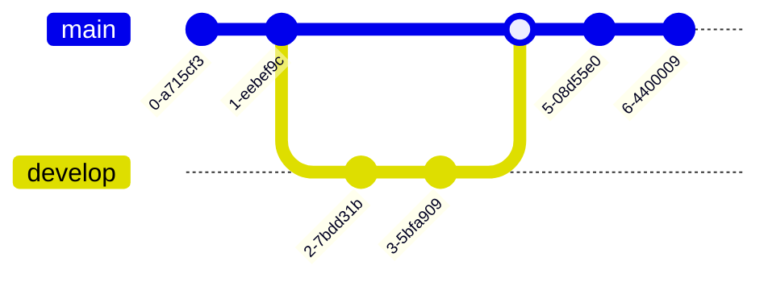
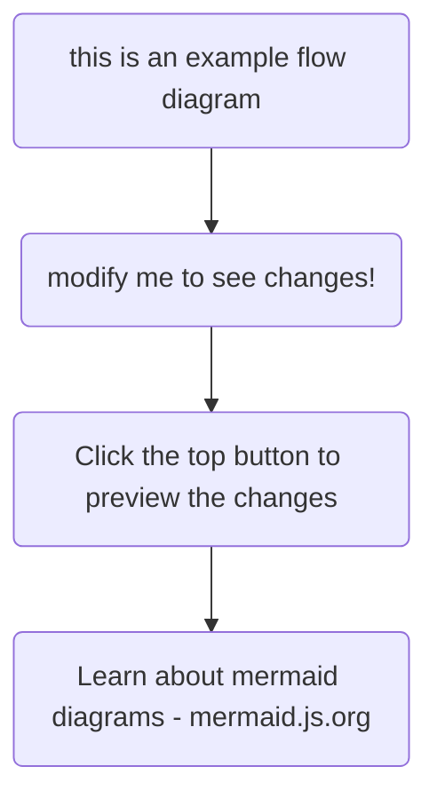

Lorem Ipsum is simply dummy text of the printing and typesetting industry. Lorem ***Ipsum*** has **been** the industry's standard dummy text ever since the 1500s, when an unknown printer took a galley of type and scrambled it to make a type specimen book. It has survived not only five centuries, but also the leap into electronic typesetting, remaining essentially unchanged. It was popularised in the 1960s with the release of Letraset sheets containing Lorem Ipsum passages, and more recently with desktop publishing software like Aldus PageMaker including versions of Lorem Ipsum.

## Highlight mark demo

You can use ==double equals== to ==highlight text==, just like a ==highlighter pen==.

Combine it with other marks: **==bold and highlighted==** or *==italic and highlighted==*.

You can type `==text==` directly in the editor and it will be saved and rendered correctly.

## Callout component demo

Plain text before the callout.

<Callout
  text={<>
    This is a simple callout component embedded in the post.
  </>}
/>

Text ==with highlight== after the callout.

<Callout
  text={<>
    This callout has ==highlighted text== inside the component.
  </>}
/>
