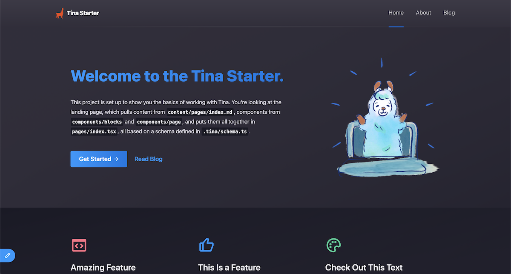
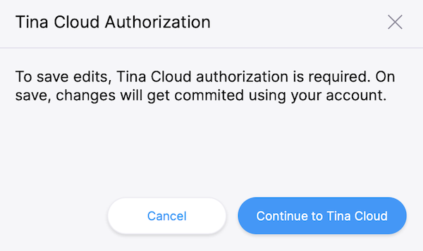
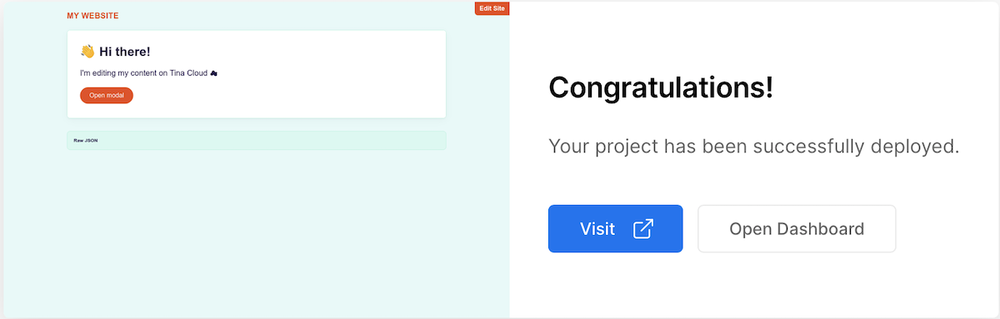
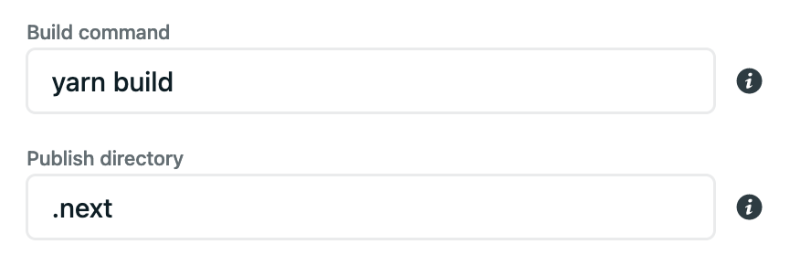
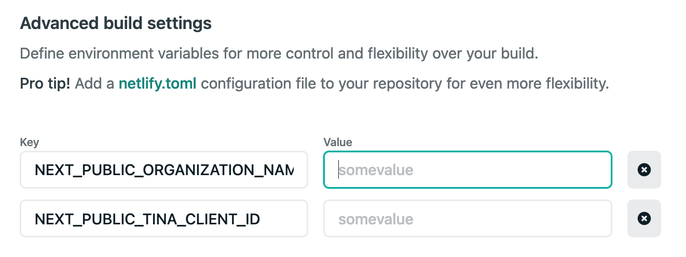

# Tina Cloud Starter 🦙

Basic TinaCMS starter based on [Next.js](https://nextjs.org) and [TinaCMS](https://tina.io) that connects to TinaCMS Content API.



## Video Tour

Watch our video guide to get started in less than 10 minutes.

[](http://www.youtube.com/watch?v=Y-fG7qzoHKw "Getting Started with Tina")

## Lighthouse Scores

   

Tina doesn't impact your website performance. This starter comes with default perfect [Lighthouse scores](https://lighthouse-dot-webdotdevsite.appspot.com//lh/html?url=https%3A%2F%2Ftina-cloud-starter-orcin.vercel.app%2F) 🚀

## Table of contents

- ❓ [What is this?](#what-is-this)
- 🍴 [Fork and Clone](#fork-this-repository)   
- ⬇️ [Install](#install)
- 🌎 [Run the project locally](#run-the-project-locally)
- 📝 [Edit content locally](#edit-content-locally)
- 🦙 [Connect to Tina Cloud](#connect-to-tina-cloud)
  - ☁️ [Register your local application with Tina Cloud](#register-your-local-application-with-tina-cloud)
  - 🔌 [Connect your local project with Tina Cloud](#connect-your-local-project-with-tina-cloud)
  - 📝 [Edit content](#edit-content)
- ⬆️ [Deploy](#deploy)
  - ▲ [Vercel](#vercel)
  - [Netlify](#netlify)
- 🗂 [Starter structure](#starter-structure)
- 📐 [Content Modeling](#content-modeling)
- 💡 [Local development workflow tips](#local-development-workflow-tips)
- 🆘 [Getting Help](#getting-help)

## What is this?

This is a [TinaCMS](https://tina.io)-enabled Next.js app, so you can edit your content on a live page. In this project the Tina file-based CMS is used via GraphQL: it's powered by a schema that _you_ define. It not only serves content from Markdown files in your repository, but it also generates TinaCMS forms for you automatically ✨.

### Scope

- Run this project locally using local content within this repository.
- Connect to Tina to benefit from its GraphQL Content API.
- Deploy the site to visually edit your site.
- Invite collaborators.

## Requirements

- Git
- [Node.js Active LTS](https://nodejs.org/en/about/releases/)
- Yarn
- [Cloudinary](https://cloudinary.com) account for media support

## Fork this repository

 ⚠️⚠️ Start by **forking** the repository and then pull it down to your computer. ⚠️⚠️

## Install

> ℹ️ This project uses `yarn` as a package manager, if `yarn` isn't installed on your machine, open a terminal and run `npm install -g yarn`

Install the project's dependencies:

```
yarn install
```

> ⚠️ If you'd like to use `npm` beware that there is no `package-lock.json` so we can't guarantee the dependencies are the same for you.

## Run the project locally

To run the local development server:

```
yarn dev
```

This command starts the GraphQL server and the Next.js application in development mode. It also regenerates your schema types for TypeScript and GraphQL so changes to your `.tina` config are reflected immediately.

One of the most interesting aspects of the Tina Content API is that it doesn't actually require anything from the backend to work locally. Since Tina is by default a Git-backed CMS, everything can be run from your local filesystem via the CLI. :sunglasses:

This is ideal for development workflows and the API is identical to the one used in the cloud, so once you're ready to deploy your application you won't face any challenges there.

Open [`http://localhost:3000`](http://localhost:3000) in your browser to see your file-based content being loaded from the GraphQL API.

## Edit content locally

We need to define some local environment variables in order to edit content with Tina.

Copy `.env.local.sample` to `.env.local`:
```sh
cp .env.local.sample .env.local

```

`NEXT_PUBLIC_USE_LOCAL_CLIENT` should be set to `1`, other values can be ignored for now.

Restart your server and visit [`http://localhost:3000/`](http://localhost:3000/`), and click "enter edit mode" in the top right hand corner, the same page is displayed but you can notice a pencil icon at the bottom left corner.

Click to open Tina's sidebar which displays a form with fields you can edit and see update live on the page.
Since we're working locally, saving results in changes to your local filesystem.

From here, you're ready to start building your own project, to read a little bit about how this project is structured, and how to modify it to make it your own,
read the [folder structure](#starter-structure) section below.

When you're ready to deploy your site, read on about how you can connect to Tina Cloud and make authenticated changes via our Cloud API.

> **NOTE:** In this project there are two way to enter edit mode. You can click the "enter edit mode button" or visit [`/admin`](http://localhost/admin). You can also disable the edit button by setting `NEXT_PUBLIC_SHOW_EDIT_BTN=0` in `.env.local`

## Connect to Tina

While the fully-local development workflow is the recommended way for developers to work,
you'll obviously want other editors and collaborators to be able to make changes on a hosted website with authentication.

> ℹ️ Changes in edit mode show up on your home page after your site finishes a rebuild.

## Register your local application with Tina 

1. Visit [app.tina.io](https://app.tina.io/register) and sign in.
2. Create a new app in Tina which connects to the GitHub repository you've just forked. Once your app is created, click on the app to get to the app settings and copy the client ID.

## Connect your local project with Tina

In the `env.local` file set:

- `NEXT_PUBLIC_USE_LOCAL_CLIENT` to `0`.
- `NEXT_PUBLIC_TINA_CLIENT_ID` to the Client ID displayed in your Tina Cloud App.
- `NEXT_PUBLIC_SHOW_EDIT_BTN` to `0` or `1`, `0` means there is no "enter edit 
- `NEXT_PUBLIC_CLOUDINARY_CLOUD_NAME` to your Cloudinary cloud name
- `NEXT_PUBLIC_CLOUDINARY_API_KEY` to your Cloudinary API key
- `CLOUDINARY_API_SECRET` to your Cloudinary API secret
mode" and you will have to visit [`/admin`](http://localhost/admin)  to enter edit mode.

> **NOTE:** You can read more about the `next-tinacms-cloudinary` package in [this blog post](https://tina.io/blog/manage-your-media-with-cloudinary/) and in the [package docs](https://tina.io/packages/next-tinacms-cloudinary/

Restart your server and run `yarn dev` again.

Open [`http://localhost:3000/`](http://localhost:3000/`) and click "enter edit mode"



This time a modal asks you to authenticate through Tina Cloud. Upon success, your edits will be sent to the cloud server (and subsequently to GitHub).

#### Edit content

Make some edits through the sidebar and click save.
Changes are saved in your GitHub repository.

Now that Tina editing is working correctly, we can deploy the site so that other team members can make edits too.

> ℹ️ Gotcha: since your changes are being synced directly to Github, you'll notice that when your in non-"edit" mode your page still receive the unedited data from your local filesystem. This is mostly fine since editing with Tina Cloud is designed for hosted environments. But beware that changes to your schema may result in a mismatch between the Tina Cloud API and your local client.

## Deploy

### Vercel

[](https://vercel.com/new/)

Connect to your GitHub repository and set the same environment variables as the ones in your `env.local` file:

```
NEXT_PUBLIC_TINA_CLIENT_ID= <YOUR_CLIENT_ID>
```



🎉 Congratulations, your site is now live!

You can test that everything is configured correctly by navigating to `[your deployment URL]/`, click "edit this site",
log in to Tina Cloud, and making some edits. Your changes should be saved to your GitHub repository.

### Netlify

[](https://app.netlify.com/start/)

Connect to your GitHub repository, then:

- set the **build command** to `yarn build`,
- set the **publish directory**. To `.next/` .



Click on **advanced** to add the same environment variables as the ones in your `env.local` file:

```
NEXT_PUBLIC_TINA_CLIENT_ID= <YOUR_CLIENT_ID>
```



Copy-paste your Organization ID and Client ID.

Once you're done, click "Deploy site".

Install the ["Next on Netlify" plugin](https://www.netlify.com/blog/2020/12/07/announcing-one-click-install-next.js-build-plugin-on-netlify/)
in order to take advantage of server-side rendering and Next.js preview features.

Trigger a new deploy for changes to take effect.

You can test that everything is configured correctly by navigating to `[your deployment URL]/`, click "edit this site",
log in to Tina Cloud, and making some edits. Your changes should be saved to your GitHub repository.

---

## Starter structure

Tina Cloud Starter is a [Next.js](https://nextjs.org) application. The file-based routing happens through the `pages` directory. To edit this site click the "edit this site" button. This will causes you to go into edit mode where Tina is loaded. Tina is only loaded in edit mode so it will not effect the production bundle size.

### `pages/index.tsx`

This page can be seen at `http://localhost:3000/`, it loads the content from a markdown file which can be found in this repository at `/content/marketing-pages/index.md`. You can edit this page at by clicking the "enter edit mode" button in the top right hand corner


We wrap the site in a small `EditProvider` component, that stores whether or not we are in edit mode in React state and localstorage. When we are in edit mode it triggers authentication when needed, and then one is in edit mode. 

What makes this possible is `getStaticProps`: you can notice that every editable page exports a `query` prop and a data prop from `getStaticProps`. When we are not in `editMode` we use the data prop to render the site. When we are in edit mode we use the query to fetch the latest data from Tina Cloud and create the sidebar form.

### `pages/posts/[filename].tsx`

The posts are stored in the `content/posts` directory of this repository, and their routes are built with `getStaticPaths` dynamically at build time. To go in edit mode, click the "edit this site" button. This  re-renders your site  by wrapping it when a `TinaProvider` component, this only happens in edit mode to make sure Tina is not added to your production bundle.

### `components`

Most of the components in this project are very basic and are for demonstration purposes, feel free to replace them with something of your own!

## Content Modeling

With Tina Cloud there's no need to build forms manually like you would with TinaCMS. Instead, you're required to define a schema which acts as the single source of truth for the shape and structure of your content.

This is set up for you in `./.tina/schema.ts`, let's break down what this function is doing:

```ts
import { defineSchema } from "tina-graphql-gateway-cli";

export default defineSchema({
  collections: [
    {
      label: "Blog Posts",
      name: "posts",
      path: "content/posts",
      templates: [
        {
          label: "Article",
          name: "article",
          fields: [
            {
              type: "text",
              label: "Title",
              name: "title",
            },
            {
              type: "reference",
              label: "Author",
              name: "author",
              collection: "authors",
            },
          ],
        },
      ],
    },
  ]
}
```

### `defineSchema`

Be sure this is your default export from this file, we'll validate the schema and build out the GraphQL API with it.

### `collections`

The top-level key in the schema is an array of _collections_, a `collection` informs the API about _where_ to save content. You can see from the example that a `posts` document would be stored in `content/posts`, and it can be the shape of any `template` from the `templates` key.

### `templates`

Templates are responsible for defining the shape of your content, you'll see in the schema for this starter that we use `templates` for `collections` as well as `blocks`. If you look at the `landingPage` template, you'll notice that it has a set of `blocks`, which are also templates.

## Local development workflow tips

### Typescript

A good way to ensure your components match the shape of your data is to leverage the auto-generated TypeScript types.
These are rebuilt when your `.tina` config changes.

### Visual Studio Code

#### GraphQL extension

Tina Cloud generates your GraphQL schema automatically. 🪄

[Install GraphQL extension](https://marketplace.visualstudio.com/items?itemName=GraphQL.vscode-graphql) to benefit from type auto-completion.

#### Forestry Schema extension

[Install Forestry extension](https://marketplace.visualstudio.com/items?itemName=jeffsee55.forestry-schema) to lint your YAML-based content models.

### Explore the GraphQL API

When your run the server locally, you can browse the GraphQL docs and test your queries in `http://localhost:4001/altair`.

## Getting Help

Tina Cloud is in public beta, you might face issues, to provide feedback or get help with any challenges you may have:

-   Read the [Tina Cloud documentation](https://tina.io/docs/tina-cloud/).
-   [Join our Discord](https://discord.gg/zumN63Ybpf).
-   Visit the [community forum](https://community.tinacms.org/) to ask questions.
-   Reach out to us on Twitter at [@tina_cms](https://twitter.com/tina_cms).
-   [Email us](mailto:support@tina.io) to schedule a call with our team and share more about your context and what you're trying to achieve.
-   Get support through the chat widget on the Tina Cloud Dashboard

## LICENSE

Licensed under the [Apache 2.0 license](./LICENSE).
