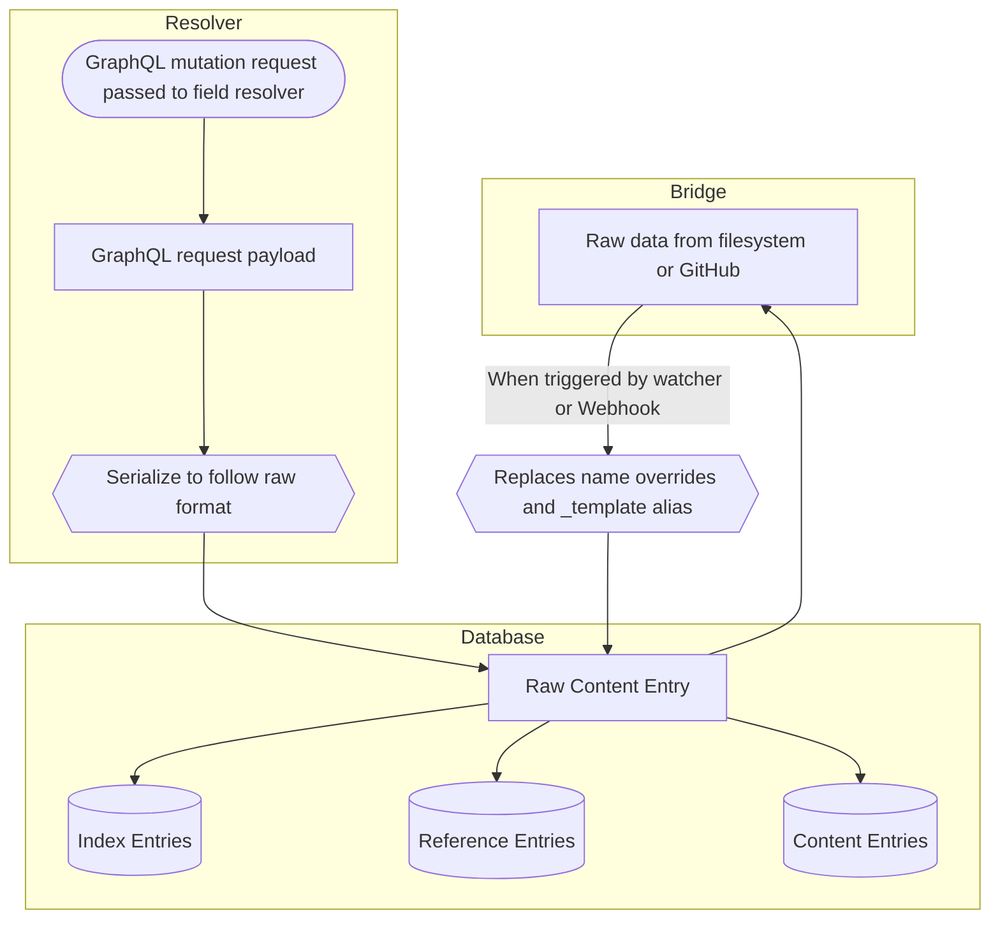
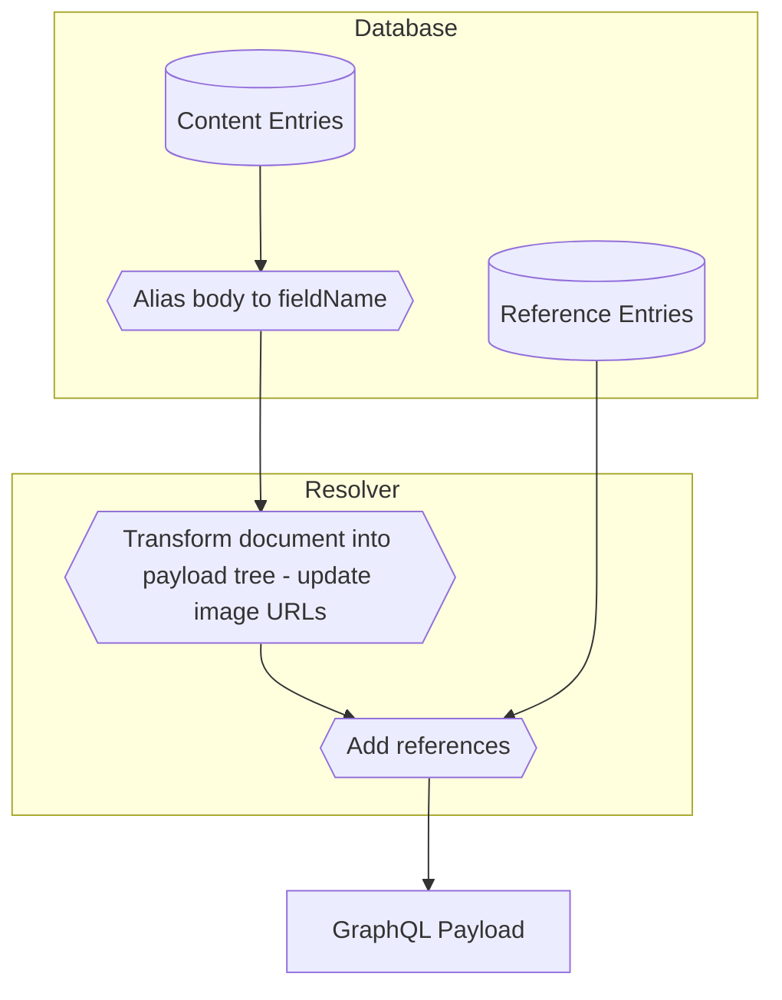
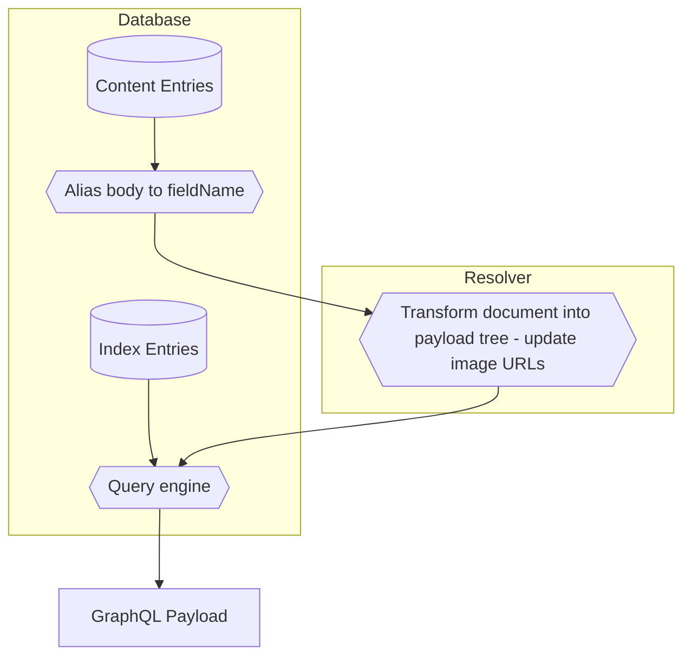

# Index Generation and Querying Process

This document explains how a collection of folders and files can be turned into a database that can be queried using [GraphQL](https://tina.io/docs/graphql/queries)

## Requirements for a TinaCMS database

A TinaCMS content database's structure is defined by 3 documents:

- TinaCMS schema (loaded from `_schema.json`): The definition of the shape of the content. The other documents are built based on this description.
- GraphQL schema (built from `_graphql.json`): This informs the [GraphQL interpreter](https://github.com/graphql/graphql-js) how to interpret TinaCMS GraphQL requests.
- Lookup collection (loaded from `_lookup.json`): Provides additional information to the resolver regarding the types of collections.

## Lifecycle of a TinaCMS database

A TinaCMS database has 2 sub-components:

1. A `bridge`, which provides direct access to the original, canonical content. It is through the bridge that changes to the underlying content are retrieved and mutations are written.
2. A `databaseAdapter` to access the Content Index, which stores temporary information required to support querying the content in a LevelDB instance.

TinaCMS requires both to operate correctly, and they need to be kept up to date. This is managed between the `Database` and `Resolver` classes.

The typical lifecycle for a database within a program is as follows.

### First indexing

1. A `Database` instance is created with:
    - A `bridge` providing access to the content (e.g. a `FileSystemBridge` when running `tinacms dev` locally).
    - A `databaseAdapter` providing access to the Content Index, which is a [LevelDB instance](https://github.com/google/leveldb) (e.g. a [`MemoryLevel`](https://github.com/Level/memory-level) instance when running `tinacms dev` locally).
2. The `indexContent` method on the `Database` instance is called with the TinaCMS schema, GraphQL schema and the type lookup. This populates the database with the entries required for querying the system.

Once indexing has been successfully completed:
- The `Database` can be used with a `Resolver` instance to support GraphQL queries.
    - A `Resolver` is responsible for the *partial* tranformation of data between the GraphQL data structures and the stored data structures.
    - The `Resolver` provides the image URL transformation logic used within rich text fields.
    - The `Resolver` is responsible for adding reference metadata to content.
- Further instances of `Database` may be created without a `bridge` and just a `databaseAdapter`, provided that the Content Index contains previously indexed entries. This is how TinaCloud functions.

### Mutations

Content is modified by either:
- A GraphQL mutation query, or
- By direct content changes.

When the changes are made by mutation query, the translation of the GraphQL data structures is handled by a `Resolver` instance.

The `@tinacms/graphql` package does not have a mechanism to detect direct content changes. There needs to be separate logic for monitoring for changes. For instance:

- For `tinacms dev`, a [filesystem watcher](https://www.npmjs.com/package/chokidar) is used.
- For TinaCloud, the system listens to GitHub webhook events.

## Index Schema

The Content Index is fundamentally a key-value store, but it uses functionality from the [AbstractLevel](https://github.com/Level/abstract-level) package to impose a hierarchy upon the store through "sublevels". The levels are separated by a Group Separator (ASCII hexadecimal code 1D), which will be represented as [\\GS] throughout the remainder of this document.

That heirarchy will be ignored in the rest of this document.

### Content data entries

For a file of name *filename*:

- Key: ~[\\GS]{{ filename }}
- Value: Content as it is given in the file.

### Folder entries

For every folder that is not the root folder, there is an entry of the form:
- Key: ~[\\GS]{{ collectionPath }}/{{ ~ or shaKeyOfParentFolderPath }}.{{ collectionFormat }}
- Value: {
    \_\_collection: {{ collectionName }},
    \_\_folderBasename: {{ folderBasename }},
    \_\_folderPath: {{ folderName }}
}

For every folder within another folder, there is an entry of the following form:
- Key: {{ collectionName }}_{{ shaKeyOfFolderPath }}[\\GS]{{ collectionPath }}/{{ shaKeyOfSubFolderPath }}.{{ collectionFormat }}
- Value: { }

There is an additional entry generated for each index that the folder's collection has. It is not documented here as it does not make sense.

### Index entries

The default collection sort key, which follows the pattern for a collection with name *collectionName* and file of *filename*:
- Key: {{ collectionName }}[\\GS]\_\_filepath\_\_[\\GS]{{ filename }}
- Value: { }

For any other index defined within a collection, entries will be generated for files with values for the fields within the index. Each index line will appear as follows:
- Key {{ collectionName }}[\\GS]{{ indexName }}[\\GS]{{ field1Value }}[\\GS]{{ field2Value }}[\\GS]...{{ fieldNValue }}[\\GS]{{ filename }}
- Value: { }

For both of the index entry types above, there is a duplicate entry created that is scoped to the folder path.

For the default collection sort key:
- Key: {{ collectionName }}_{{ shaKeyOfFolderPath }}[\\GS]\_\_filepath\_\_[\\GS]{{ filename }}
- Value: { }

For the other indices:
- Key {{ collectionName }}_{{ shaKeyOfFolderPath }}[\\GS]{{ indexName }}[\\GS]{{ field1Value }}[\\GS]{{ field2Value }}[\\GS]...{{ fieldNValue }}[\\GS]{{ filename }}
- Value: { }

### Reference entries

For every reference value within a field, there will be reference entries as follows:
- Key: {{ collectionName }}[\\GS]\_\_refs\_\_{{ fieldPath }}\_\_{{ filenameReferredTo }}
- Value: { }

The reference entries are important as they allow us to enforce referential integrity by querying to see if a document is referenced.

## Content transformations

### Indexing content

The following diagram illustrates how data is loaded into a TinaCMS instance. Note the following:

- A `Resolver` object is only required when responding to a GraphQL mutation request.
- The re-indexing process is handled by a `Database` instance, and no `Resolver` object is available.
- The TinaCMS schema, GraphQL schema, and Lookup collection must be build and loaded separately prior to indexing. This can be done through the `Database` instance.

### Document Retrieval Process

### Query Process

The following is as per `resolveCollectionConnection`:

